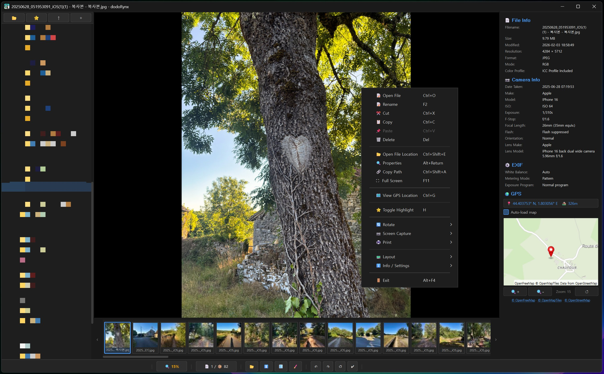
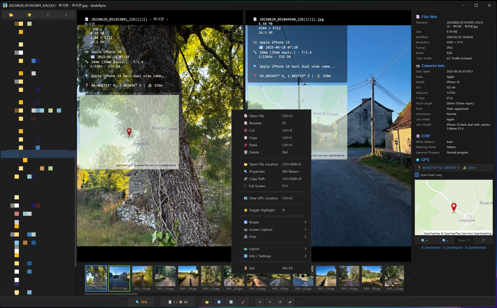
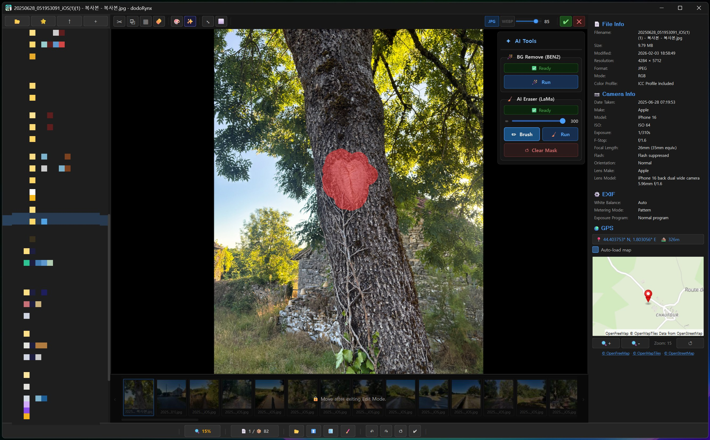

# dodoRynx (Image Viewer)

> ⚠️ This project was created for personal learning and experimental purposes.  
> Stability, compatibility, and long-term maintenance are not guaranteed.  

- dodoRynx is a desktop image viewer and management tool optimized for a folder-based workflow.
- It preloads images within folders to generate a thumbnail cache and aims to handle photo metadata, GPS maps, overlays, printing, and lightweight editing — all in a single application.


<p align="center">
  
  
  
</p>  
<br>

**Map Feature Change (Online → Offline)**
- The map service has been changed from an online mode to an offline mode.
- The previous implementation relied on a free online service, but it has been switched to an offline mode due to expected service load in the future.

**Map Data Usage**
- A pmtiles map file is required to use the map feature.
- A zoom level 8 pmtiles map file is included in the 2026-03-10 release package.
- You can download the file if needed and enable it in the settings to use the map feature.

**dditional Map Data**
- If higher-resolution maps are required, you can download the latest pmtiles map files from external sources such as Protomaps.
- Note: The full map dataset (zoom level 15) is approximately 125GB.

<br>

## ✨ Supported Formats
- Most common image formats
  (HEIC is loaded using the OS codec)
- Most RAW formats
- Animated image formats: GIF, WebP, APNG

## 🚀 Features
1. Fast Browsing & Navigation
    - Preloading images within folders
    - Thumbnail cache generation
    - Zoom features:
        - Drag zoom
        - Zoom minimap
        - Mouse wheel navigation
    - Thumbnail list sorting:
        - Default sorting
        - Metadata-based sorting
        - Folder-level sorting option is preserved during runtime (reset when the program exits)
    - Built-in folder explorer
    - Folder favorites (add/remove)

2. Metadata & Overlay
    - Read photo metadata (EXIF, etc.)
    - Copy metadata values to clipboard from the metadata panel
    - Metadata & map overlay display (designed to maintain the viewing flow)

3. GPS Map
    - Real-time map display for photos with GPS data
    - Click GPS values to open detailed map in web browser
    - Map tile & render result caching

4. Highlight Workflow (Multi-Tasking)
    - Dedicated Highlight feature (separate from normal selection)
    - Designed for filtering workflows and organizing selected items
    - Highlight folder navigation via right-click menu (reset when the program exits)

5. Lightweight Editing (Shortcut: E)
    - Basic image editing
        - Crop
        - Copy
        - Erase
        - Resize
        - Filters
        - Shape and text insertion
        - Paste external clipboard images
    - AI-related features (model downloaded once on first use, works offline)
        - AI Background Removal
        - AI Eraser (selection-based)
    - Rotation policy:
        - JPG: Reflect orientation metadata
        - RAW: Sidecar file generation
        - Other formats: Pixel-based rotation

6. Dual View (Shortcut: Ctrl + D)
    - Display two consecutive images simultaneously
    - Zoom control, overlays, and fullscreen behave the same in both views
    - Resizable layout via the center split bar

7. Print / Export
    - Print:
        - Single
        - All
        - Highlighted
    - Batch printing support
    - Save as PDF
    - Copy current screen (with overlay) to clipboard
    - Save current rendered image

8. Performance & Rendering
    - Hybrid cache:
        - Thumbnail/map cache stored on disk
        - Thumbnail and map tile cache loaded into memory on relaunch
        - Metadata memory cache
    - Multi-threading:
        - Minimum 2 threads
        - Half of CPU cores
        - Maximum 8 threads
    - OpenGL support
    - V-Sync support
    - Anti-aliasing support
    - WebP animation modes: Fast mode / Quality mode

9. i18n
    - Korean
    - English

## 🛠 Install (from source)
- Recommended: Python 3.10+

```
# Create virtual environment (recommended)
- python -m venv venv

# Activate venv
# Windows
venv\Scripts\activate
# macOS / Linux
source venv/bin/activate

# Install dependencies
pip install -r requirements.txt

# Run
python main.py
```

## 📦 Build / Distribution
- Use PyInstaller --onedir to create distribution builds
 (same distribution style as previous versions)
- When redistributing the built package, you must include:
```
Licenses/
└── third_party/
```
- All third-party license files must accompany redistribution.

### ⬇️ Prebuilt Portable Version
- A prebuilt portable **.exe** version is available on the GitHub Releases page.
- You can download the executable file directly and run it without installation.
- Available on the GitHub Releases page:
    - https://github.com/ddodoki/dodoRynx/releases

## 📄 License & Copyright
- Copyright (c) 2026 ddodoki Project (https://github.com/ddodoki/dodoRynx)
- This project is distributed under the MIT License.
- See Licenses/LICENSE.txt for the full text.
- Third-party licenses are included in:
    - Licenses/third_party/
- and must accompany any redistribution.

## 📩 Contact
For other inquiries, please contact
- Email: [ddodoki.lab@gmail.com](mailto:ddodoki.lab@gmail.com)

<br>

# 🇰🇷 한국어 버전
도도링스 (이미지 뷰어)

> ⚠️ 본 프로젝트는 개인 학습 및 실험 목적으로 제작되었습니다.  
> 안정성, 호환성, 장기 유지보수는 보장되지 않습니다.

- dodoRynx 는 폴더 기반 워크플로우에 최적화된 데스크톱 이미지 뷰어 및 관리 프로그램입니다.
- 폴더 내 이미지를 사전 로딩하여 썸네일 캐시를 생성하고, 촬영 메타데이터, GPS 지도, 오버레이, 인쇄, 간단 편집까지 하나의 앱에서 처리하는 것을 목표로 합니다.

<br>

**지도 기능 변경 (온라인 → 오프라인)**
- 지도 서비스를 온라인 방식에서 오프라인 방식으로 변경했습니다.
- 기존 무료 온라인 서비스를 사용했으나 향후 서비스 부하가 예상되어 오프라인 방식으로 전환했습니다.

**맵 데이터 사용 안내**
- 지도 기능을 사용하려면 pmtiles 형식의 맵 파일이 필요합니다.
- 2026-03-10 릴리즈 파일에 줌 레벨 8(pmtiles) 맵 파일이 포함되어 있습니다.
- 필요 시 해당 파일을 다운로드하여 적용하면 지도 기능을 사용할 수 있습니다.

**추가 맵 데이터**
- 더 높은 해상도의 지도를 사용하려는 경우 Protomaps 등 외부 사이트에서 최신 pmtiles 맵 파일을 다운로드하여 사용할 수 있습니다.
- 참고: 전체 맵 파일(줌 레벨 15 기준) 용량은 약 125GB입니다.

<br>

## ✨ 지원 포맷
- 대부분의 이미지 포맷 확장자 지원
 (HEIC 포맷은 OS 코덱을 이용하여 로드합니다)
- 대부분의 RAW 포맷 확장자 지원
- 애니메이션 이미지 포맷 지원:
    - GIF
    - WebP
    - APNG

## 🚀 주요 기능
1. 빠른 탐색 & 네비게이션
    - 폴더 내 이미지 사전 로딩
    - 썸네일 캐시 생성
    - 줌 기능:
        - 드래그 줌
        - 줌 미니맵
        - 마우스 휠 네비게이션
    - 썸네일 리스트 정렬:
        - 기본 정렬
        - 메타데이터 기반 정렬
        - 폴더 단위 정렬 옵션 자동 유지(프로그램 종료 시 초기화)
    - 폴더 탐색기 지원
    - 폴더 즐겨찾기 (추가/제거)

2. 메타데이터 & 오버레이
    - 사진 메타데이터(EXIF 등) 읽기
    - 메타데이터 패널에서 값 복사 (클립보드)
    - 메타데이터/지도 오버레이 표시 (감상 흐름 유지)

3. GPS 지도
    - GPS 정보가 포함된 사진을 실시간 지도에 표시
    - GPS 값을 클릭하면 웹 브라우저에서 상세 지도 확인
    - 지도 타일 및 렌더 결과 캐시 지원

4. 하이라이트 워크플로우 (다중 작업)
    - 일반 선택과 구분되는 하이라이트 기능
    - 선별 작업 및 작업 대상 구분에 최적화
    - 마우스 우클릭 메뉴를 통해 하이라이트 폴더 네비게이션 지원(프로그램 종료 시 초기화)

5. 간단 편집 기능(단축키: E)
    - 기본 이미지 편집 지원
        - 자르기, 복사, 지우기, 리사이즈, 필터, 도형 및 텍스트 삽입, 외부 클립보드 이미지 붙여넣기 지원
    - Ai 관련 기능(최초 1회 모델 다운로드, 오프라인 방식)
        - Ai 배경 지우기
        - Ai 지우개(선택 영역)
    - 회전 처리 정책:
        - JPG: 메타데이터(orientation) 기반 회전 반영
        - RAW: 사이드카 파일 생성 방식
        - 기타 포맷: 픽셀 단위 회전

6. 듀얼 뷰 지원(단축키: Ctrl+D)
    - 연속된 이미지 2개를 출력
    - 줌 컨트롤 및 오버레이, 전체화면에서 메인 뷰와 세컨트 뷰 동일하게 작동
    - 중앙 스플릿 바를 통해 사이즈 조절 가능

7. 인쇄 / PDF 내보내기
    - 인쇄:
        - 단일
        - 전체
        - 하이라이트
    - 묶음 프린트 지원
    - PDF 저장 지원
    - 현재 화면 클립보드 복사 (오버레이 포함)
    - 현재 렌더링 이미지 저장

8. 성능 & 렌더링
    - 하이브리드 캐시:
        - 썸네일/지도 데이터를 디스크에 저장
        - (썸네일, 지도 타일)재실행 시 메모리로 로드
        - 메타데이터 메모리 캐시 적용
    - 멀티스레드 지원:
        - 최소 2개
        - CPU 코어 절반 사용
        - 최대 8개 제한
    - OpenGL 지원
    - V-Sync 지원
    - 안티앨리어싱 지원
    - WebP 애니메이션 모드: 고속 모드/품질 모드

9. 다국어 지원
    - 한국어
    - 영어

## 🛠 설치 방법 (소스 기준)
- 권장: Python 3.10 이상

```
# 가상환경 생성 (권장)
python -m venv venv

# 가상환경 활성화
# Windows
venv\Scripts\activate
# macOS / Linux
source venv/bin/activate

# 의존성 설치
pip install -r requirements.txt

# 실행
python main.py
```

## 📦 빌드 / 배포
- PyInstaller --onedir 방식으로 빌드합니다.
- 재배포 시 반드시 다음 폴더를 포함해야 합니다:
```
Licenses/
└── third_party/
```
- 모든 서드파티 라이선스 파일은 배포 시 함께 포함되어야 합니다.

### ⬇️ 포터블 버전 제공
- GitHub 릴리즈(Release) 페이지에서 빌드된 포터블 **.exe** 버전을 제공합니다.
- 설치 없이 실행 파일을 다운로드하여 바로 사용할 수 있습니다.
- 포터블 버전 다운로드: 
    - https://github.com/ddodoki/dodoRynx/releases

## 📄 라이선스
- Copyright (c) 2026 ddodoki Project (https://github.com/ddodoki/dodoRynx)
- 본 프로젝트는 MIT License 하에 배포됩니다.
- 자세한 내용은 Licenses/LICENSE.txt 를 참고하십시오.
- 서드파티 라이선스는 다음 경로에 포함되어 있습니다:
    - Licenses/third_party/
- 배포 시 반드시 함께 포함해야 합니다.

## 📩 기타 문의
문의사항이 있으시면 아래 이메일로 연락해주세요.
- Email: [ddodoki.lab@gmail.com](mailto:ddodoki.lab@gmail.com)
